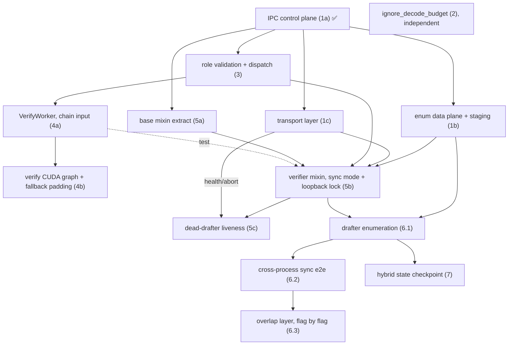

# [Roadmap] Parallel Speculative Decoding Roadmap

> Revision note: revised from a **response-based** design (drafter free-runs one chain, rolls back on divergence, streams tokens one by one) to an **enumeration-based** design (drafter pre-enumerates every possible verify outcome one round ahead; verifier selects on GPU). The response-based per-token host reconciliation plus rollback sat on the verify critical path as un-hideable CPU overhead; enumeration replaces both with a GPU select, leaving the CPU with pure scheduling and buffer forwarding.

## Background

### Today in SGLang: colocated speculative decoding

All of SGLang's existing speculative decoding (EAGLE, EAGLE3, standalone draft model, …) runs the draft model and the target model **in the same process, on the same GPU group**. One scheduler drives a tight "draft → verify → accept" loop, and the two steps share memory and run back-to-back.

### This feature: parallel speculative decoding (enumeration-based)

Parallel speculative decoding runs the draft and target models in **two separate processes** that talk only over a network channel (e.g. ZMQ). The **drafter** runs **one round ahead** of the **verifier**: instead of waiting for the accept result, it **enumerates every possible outcome** of the in-flight verify round (all `K+1` accept lengths × `F` guesses for the bonus token) and pre-drafts the next `K`-token continuation chain for each combination, packing them into one **enumeration buffer** it pushes ahead of time. When the verifier finishes a round it knows the real accept length and bonus token, so it **selects on the GPU the one pre-drafted chain that matches reality** and verifies it next round, with no cross-process round-trip on the critical path. Only the verifier returns tokens to the user. If reality does not match (the real bonus is not among the `F` guesses, or the buffer is missing / stale), the request **falls back** to a plain 1-token decode seeded by the bonus token, always correct and at worst equal to non-speculative decoding; one unified fallback covers fan-out miss, cold start, drafter lag, and a dead drafter.

### The two processes and what each owns

**Verifier — runs the big target model.**
- Owns the committed output: it alone decides which tokens are final, when a request stops, and is the only process that streams tokens to the user.
- Each round it uses the previous round's real accept length and bonus token to **select on the GPU** the matching chain out of the enumeration buffer, verifies it with one target forward, and commits. Buffer **usability is judged on the GPU** too: the carried `base_committed_len` *version* vs the current committed length (arrival / staleness), and the real bonus vs the `F` guesses (hit / miss).
- Batch composition stays **pure scheduling** (policy + memory), exactly as today — it never reads buffer state; unusable requests take the fallback inside the same batch.
- Drives the drafter with control messages and assigns each request to a drafter: *sync* opens a new request, *commit* confirms accepted tokens (and triggers the drafter's next enumeration round), *close* ends a finished one.
- Host side keeps only a thin pinned **staging** (daemon thread receives, lands in pinned memory, forwards to a preallocated GPU buffer); no per-token host reconciliation.

**Drafter — runs the small draft model.**
- Runs **exactly one round ahead**, driven by commits: each commit fixes the previous round's winning branch, and the drafter drafts the next enumeration buffer from the new committed prefix and pushes it. Requests are opened and closed only by the verifier's messages.
- The enumeration is drafted as **one shared-prefix tree in a single multi-step forward**: backbone = its own `K` draft tokens (the `K+1` accept cases are its nested prefixes, free), `F` bonus guesses per backbone node (reusing the top-`F` logits already computed), then a plain `K`-token chain from each guess. This keeps cost a small constant multiple of a normal draft round, **not** `(K+1)×F` independent drafts.
- **No rollback:** a wrong branch is simply never selected; the whole previous tree is discarded on the next commit and re-extended from the committed prefix.

### Glossary
- **Drafter / Verifier** — as above.
- **Committed prefix** — the output tokens the verifier has finalized; every buffer records the committed length it was drafted from.
- **Enumeration buffer** — the drafter's per-round product: a `B × (K+1) × F × K` block of **token ids only** (`K` = speculative steps, `F` = bonus fan-out, `K+1` = possible accept lengths of the in-flight verify round); in effect a lookup table over "everything the verifier might do".
- **Fan-out `F` / hit / miss** — the drafter guesses the bonus token `F` ways (top-`F`); *hit* = the real bonus is among them (chain usable), *miss* = not (fallback).
- **Fallback** — the unified degradation: a missing / stale / fan-out-missed request does a plain bonus-seeded 1-token decode padded to the verify shape. Always correct.
- **Version (`base_committed_len`)** — carried by every buffer; the GPU compares it against the current committed length for arrival/staleness, replacing host-side reconciliation.
- **Accept length / bonus token** — as before; they additionally double as the **select keys** into the enumeration buffer.

### Key components

- **IPC protocol** — control plane unchanged: verifier→drafter `DraftSync` / `VerifyCommit` / `DraftClose` (batched in `DraftControlBatch`), where a commit also triggers the drafter's next enumeration round. Data plane replaced: `DraftTailStreamOutput` → an enumeration-buffer push message (the `(K+1)×F×K` block + its `base_committed_len`), with a new `--speculative-fanout` server arg for `F`. The control plane is M:N-native: every message carries `DraftReqKey = (src_verifier_rank, request_id)` plus an explicit destination rank, so multi-drafter ↔ multi-verifier routing is per-request from day one.
- **Transport layer** — unchanged in structure (real ZMQ + in-process fake behind one interface); the enumeration block is tiny (token ids only, tens of KB), so the existing object transport suffices. The **fake transport doubles as the single-process loopback harness**.
- **Enumeration buffer staging (verifier side)** — replaces `DraftTailBuffer`: a thin pinned staging + slot rotation forwarding to a preallocated GPU buffer, with **all usability judgment on the GPU**. The old buffer's stale-base rejection logic is kept only as the reference for the GPU version check.
- **GPU select & usability judgment** — before each verify forward, two gathers: first pick this batch's rows by `req_pool_indices`, then version check + bonus match, followed by `index_select` of the winning chain as verify input. The bonus never leaves the GPU (no host sync, TP-consistent).
- **Unified fallback** — one mechanism for fan-out miss / not arrived / stale base / cold start / dead drafter: a bonus-seeded 1-token decode padded into the batch. New requests need no special entry path.
- **`VerifyWorker` (and `BaseVerifyWorker`)** — contract unchanged (verify-only, target-only). Verify input is the **selected linear chain**: no tree construction, no local draft.
- **Scheduler mixin split** — unchanged (`SchedulerDecoupledSpecBaseMixin` + one subclass per side).
- **Drafter simplifications** — exactly **one round ahead** per request (draft one buffer per commit, consume one per verify; no backpressure/sleep machinery needed); **no rollback** (discard the tree and re-extend from committed each round; keep-winning-branch KV is a future opt); and hybrid **linear-attention state** reduces to a single committed-point checkpoint per request (no rollback ring).
- **Sync vs overlap mode** — the same semantics, protocol, and buffers run two ways: **sync** (verifier waits per round, judgment may run on CPU) is the deterministic correctness lock, not scaffolding; **overlap** adds the receive daemon + copy stream + double buffer + GPU judgment + async commit return.
- **`ignore_decode_budget`** — the drafter's mirror requests are perpetual (unbounded max_new_tokens, closed only by `DraftClose`), so the normal admission-time reservation for future decode tokens is meaningless for them and would throttle drafter admission to near zero. This drafter-only flag drops that reservation, so drafter admission depends only on the real current KV footprint; memory stays bounded by the one-round-ahead pacing. The verifier keeps the normal reservation (its requests are real user requests with real max_new_tokens).

### How this gets tested

Because enumeration correctness is the novel core, it is proven **inside a single process first**, using the fake transport as a loopback:
- **CPU unit tests** — protocol dataclasses (incl. the new enumeration-buffer message), staging/slot rotation, and select-index arithmetic.
- **Single-process loopback integration** — verifier + scripted fake drafter over the fake transport in sync mode: committed output **token-for-token identical** to the non-speculative baseline, and hit/miss accounting matches the scripted scenario (the correctness lock).
- **Real end-to-end** — two processes + GPUs + real ZMQ, sync mode first then overlap flag by flag: output identical, then speedup + bubble/hit-rate metrics.

## Motivation

Colocated speculative decoding puts the draft model on every verify step's critical path and forces the two models onto shared placement; decoupling them into two processes overlaps draft and verify and lets each be scaled and placed independently. Within the decoupled design, enumeration (vs response-based) moves the entire "which draft continues" decision onto the GPU and off the wire, so the steady-state verify loop has no cross-process wait and no per-token host reconciliation.

## Design Overview

```
                        client request (prompt)
                                   |
                                   v
   +=================================================================+
   |            VERIFIER  --  target model  (authoritative)          |
   |  +--------------------------+  +----------------------------+   |
   |  | VerifyWorker             |  | Enum buffer (GPU, per-req) |   |
   |  | verify the SELECTED      |  | B x (K+1) x F x K token ids|   |
   |  | chain; accept prefix     |  | + version(base_committed)  |   |
   |  | + 1 bonus token          |  | GPU: version check + bonus |   |
   |  +--------------------------+  | match -> index_select chain|   |
   |  daemon: recv -> pinned     |  | miss/stale/absent -> fall- |   |
   |  staging -> H2D (own stream)|  | back (1-token bonus decode)|   |
   |                             |  +----------------------------+   |
   +=================================================================+
      |  control: DraftSync / VerifyCommit / DraftClose  ^  data:
      |  (commit also triggers the next enumeration)     |  enumeration
      v                    [ ZMQ ]                       |  buffer push
   +=================================================================+
   |        DRAFTER  --  draft model  (exactly one round ahead)      |
   |  on each commit: previous tree discarded; re-extend from the    |
   |  committed prefix; draft ONE shared-prefix tree in one pass:    |
   |     backbone = own K draft tokens  (K+1 accept cases = its      |
   |     nested prefixes, free)                                      |
   |     x F bonus guesses per node (top-F logits, already computed) |
   |     x K-token chain continuation per guess                      |
   |  pack -> push enumeration buffer.  NO rollback.                 |
   +=================================================================+
                                   |
              committed tokens -> stream_output -> client
```

## Initial PR
#22520 (response-based prototype; architecture skeleton and protocol reused, data plane and drafter loop revised per this document)
#22272

## Roadmap

### IPC protocol and transport foundation
- [x] **IPC protocol and config (1a)** — merged. https://github.com/sgl-project/sglang/pull/27634 The control plane (`DraftSync` / `VerifyCommit` / `DraftClose`) is used as-is.
- [ ] **Enumeration data plane + verifier staging (1b)** — Replace the per-token streaming message (`DraftTailStreamOutput`, which has no producers or consumers on main yet) with an enumeration-buffer push message carrying the `(K+1)×F×K` token block and the `base_committed_len` it was drafted from; add the `--speculative-fanout` server arg; and implement the thin verifier-side pinned staging (deliberately no state machine — the old `DraftTailBuffer` stale-base logic survives only as the reference for the GPU version check). CPU unit tests cover the message round-trip and the staging bookkeeping. (Rework or close-and-replace https://github.com/sgl-project/sglang/pull/27982.)
- [ ] **Transport layer (1c)** — Land as-is. https://github.com/sgl-project/sglang/pull/29610 The fake transport doubles as the single-process loopback harness used from 5b on; the enumeration block may need at most a minor payload-type accommodation.

### Role validation and verify compute path
- [ ] **Role validation and dispatch (3)** — Land as-is. https://github.com/sgl-project/sglang/pull/29968 Once 1b adds `--speculative-fanout`, validate it here.
- [ ] **`VerifyWorker` (4a)** — Extract the thin `BaseVerifyWorker` base (verify-only contract: holds the target worker, no draft model) and implement one target-side `VerifyWorker` in eager mode for the STANDALONE drafter. It builds its verify input from externally provided chain tokens (bonus + K tokens), plus the trivial 1-token fallback layout, and runs the shared verify path; no local draft, no tree construction. The scheduler's role branch (worker init, target-only memory pools, model_worker dispatch) lands here. Validated against colocated verify on identical scripted inputs, with no drafter required.
- [ ] **Verify CUDA graph (4b)** — Make the verify forward CUDA-graph capturable at the fixed `(bs, K+1)` shape, including mixed batches of selected-chain rows and padded fallback rows, with results identical to eager.

### Scheduler mixin split, verifier integration, liveness
- [ ] **Shared base mixin (5a)** — Extract `SchedulerDecoupledSpecBaseMixin`. Refactor-only, no behavior change.
- [ ] **Verifier-half integration, sync mode (5b)** — Implement the verifier half (`SchedulerDecoupledVerifyMixin`): the verifier scheduler hooks (sync / commit / close, and feeding received enumeration buffers into the verify path) plus acceptance metrics, running in sync mode. The verifier half then runs end-to-end against a scripted fake drafter over the fake transport in a single process, and its committed output must be token-for-token identical to the non-speculative baseline — the correctness lock for everything after it.
- [ ] **Survive a dead drafter (5c)** — Much smaller than in the response-based design: when a drafter dies, buffers simply stop arriving and every request takes the unified fallback, so the verifier keeps serving autoregressively. What remains is liveness detection through the transport health seam, stopping sync/commit sends toward the dead peer, and metrics/logs.

### Drafter integration
- [ ] **Drafter-half enumeration (6.1)** — Implement the drafter half (`SchedulerDecoupledDraftMixin`): open and close draft requests from the verifier's messages, and on each commit re-draft the next enumeration buffer from the new committed prefix as one shared-prefix tree in a single pass, then push it. There is no rollback path; the previous round's tree is simply discarded. (Keeping the winning branch's KV instead of re-extending is a listed future optimization.)
- [ ] **Cross-process sync end-to-end (6.2)** — Run the 5b verifier and the 6.1 drafter as two real processes over real ZMQ, still in sync mode (one buffer per commit, the verifier waits each round) — this is the enumeration steady state run synchronously, not scaffolding. Output must match the 5b loopback and the non-speculative baseline, and the setup is also exercised on an M:N topology (e.g. 2 verifiers ↔ 1 drafter) to cover the per-request routing.
- [ ] **Overlap layer (6.3)** — Turn on production overlap one gated flag at a time, each verified as "output unchanged, bubble reduced": metrics first (hit rate, fallback rate by cause, drafter-ahead, verify-GPU bubble), then the asynchronous buffer landing (receive daemon, dedicated copy stream, double-buffered GPU buffer), GPU-side usability judgment and select, mixed-batch fallback padding under CUDA graph, asynchronous commit return, and reuse of the existing seq-lens relay so scheduling never waits on accept results.
- [ ] **Hybrid linear-attention drafter state (7)** — With per-round re-extension the drafter only needs the recurrent state at the committed prefix: keep a single per-request checkpoint, restored before each re-extension; no rollback ring. Dense drafters are unaffected; validate with a dense drafter first.

### Independent enhancements (can land in parallel)
- [ ] **Admission `ignore_decode_budget` (2)** — Land as-is. https://github.com/sgl-project/sglang/pull/29868 Drafter-only gate (`decoupled_spec_role == "drafter"`): guards every future-decode reservation site in `PrefillAdder`, so perpetual mirror requests are admitted on their real KV footprint instead of a meaningless max_new_tokens-based reservation.

### Dependency graph



### Future / out of current scope

- **Rejection sampling** — the token-ids-only buffer is exact for the default sampling path; `speculative_use_rejection_sampling` requires per-branch draft probabilities in the buffer (or stays disabled with enumeration).
- **Enumeration cost tuning** — dynamic `F`, pruning unlikely accept cases, a global node cap on the enumeration tree (the existing draft-result pruning is the reference).
- **Keep-winning-branch KV** — avoid the per-round re-extension by compacting the hit branch's KV (the colocated accept-path finalize is the reference); an optimization on 6.1.
- **Hidden-state data plane (EAGLE / MTP)** — the token-only transport suffices for a standalone drafter; EAGLE/MTP drafters consume the target's *hidden states*, so decoupling them needs a GPU-direct data plane (RDMA) alongside the ZMQ control plane. Note that enumeration is only exact for **token-conditioned** drafters: a hidden-state-conditioned drafter would enumerate from self-produced hidden states at some accept-rate cost, or wait for the target's hidden states and give up the overlap (a measured trade-off, not covered here).
- **Other draft algorithms on the verify path** — NGram shares the verify compute with a different input source; DFlash has genuinely different verify compute (its own `BaseVerifyWorker` subclass) and needs the hidden-state plane. Built-ins branch on the `SpeculativeAlgorithm` enum; no new algorithm is registered.
- **PP guard / M:N policy tuning** — a `pp_size == 1` guard (the PP handshake is unvalidated). Basic M:N routing is protocol-native and covered by the phases above; what remains here is drafter-assignment and load-balancing policy for large M:N deployments.
