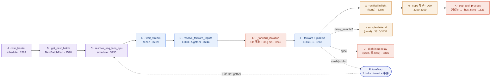

# Spec-V2 Overlap Schedule 全景（深挖版）

> 为「解耦投机解码迁移到 overlap schedule」建立的运行时全景：几条流、每个节点在干什么、有哪些同步——本版把 WAR 读写两端、schedule_stream 的逐 op 清单、token buffer 的写读闭环全部下钻到 kernel/行级。
>
> **基线**：**origin/main @ `789bc3995`**（2026-07-10 fetch）。所有 `file:line` 均为对该 commit 的实读复核值（8 个维度深挖 + 逐条独立对码复核，197 条要害断言 0 条 wrong）。⚠️ 当前工作树在分支 `decoupled-spec-4a-verify-worker` @ `ffe86ba51`，**落后 main 232 个 commit**——文中可点击链接在 rebase 前可能偏移，行号以 main 为准。
>
> **⚠️ 基线勘误（重要）**：旧版把 `ffe86ba51` 描述为「= phase3 已 merge 最新 main」——错位。`ffe86ba51` 是**分支** merge commit，含 Phase 2/3 decoupled 代码；**main 上 decoupled 只有 Phase 1a（#27634：`server_args.py:1759-1785` 的 4 个 `decoupled_spec_*` flag + `decoupled_spec_io.py`）**。旧版引用的 `speculative_hook.py` force-off（"To support overlap, have the decoupled mixin relay per-step results as futures"）、mixed-chunk 强关、role dispatch 全部是**分支专有代码**，main 上不存在。
>
> **一句话**：overlap 的本质是——CPU 构建/启动第 N+1 步时，**永远不需要**第 N 步的 token 值，只要 `req_pool_idx` 句柄；token 值作为 GPU 常驻 future 延迟到 forward 入口再 gather。跨迭代只压成两条数据边（**EDGE-A** = token 值 + spec extras、**EDGE-B** = accept-len→seq_lens），全部经 [FutureMap](../managers/overlap_utils.py#L128) 中继；流水线 depth = 1。

自 `ffe86ba51` 以来 main 上 overlap 平面**仅有的两个 device 语义变更**：
1. **#30435**（2026-07-08）：`publish` 链式 record（[overlap_utils.py:352-357](../managers/overlap_utils.py#L352)）——off-forward-stream 的 publish 不再可能冲掉 in-flight forward 的 fence（§10.4）；
2. **#29787**（2026-07-06）：EDGE-A 载荷新增 `dsa_topk_indices`（GLM-5.2 MTP IndexShare），relay 面从 4 buf 组扩到 5+。

另有两组**纯 host 重构**须注意：#29408/#29407/#30707 把 `get_next_batch_to_run` 改成显式传参、返回 `NextBatchPlan`（[schedule_batch.py:3067-3069](../managers/schedule_batch.py#L3067)），`cur_batch → cur_batch_for_debug`——**4a 落地 scheduler 分支时必须按新签名**；#30044 把 `speculative/triton_ops/{cache_locs,gather_spec_extras}.py` 迁至 [`python/sglang/kernels/ops/speculative/`](../../kernels/ops/speculative/cache_locs.py)（旧路径已删除）。

---

## 1. CUDA stream 拓扑

| Stream | Owner | 承载的 op | Drafter 用? | 创建 |
|---|---|---|---|---|
| **schedule_stream** | `Scheduler` | **所有 event loop** 的 ambient 流（不只 overlap，见下）；节点 B 的全部 alloc/写池 kernel；WAR-barrier 写侧；节点 K 的释放 kernel | ✓ | [scheduler.py:1506](../managers/scheduler.py#L1506)，`priority=0` |
| **forward_stream** | `ModelRunner` | 模型 forward（target + draft）；`req_to_token` 的读侧主场；EDGE-A stash/gather 主场 | ✓ | [model_runner.py:554](../model_executor/model_runner.py#L554)；scheduler 经 `get_worker_info()` 解包（[scheduler.py:876](../managers/scheduler.py#L876)） |
| **copy_stream** | `Scheduler` | 结果 D2H **叶子**：[copy.wait_stream(forward) :3304](../managers/scheduler.py#L3304) 后拷贝，不阻塞下一轮 forward；PP（非 overlap）也用它 → **无条件初始化**（:1265-1266 注释） | ✓ | [scheduler.py:1270-1273](../managers/scheduler.py#L1270) |
| **fwd_prepare_d2h_stream** | `FutureMap`（CUDA-only） | 把 `new_seq_lens_buf` **整表**拉进静态 pinned buffer，不 stall schedule 流 | inert | [overlap_utils.py:168-175](../managers/overlap_utils.py#L168) |
| **plan_stream 生态** | 见下 | prepare 与 compute 并发（默认关 `SGLANG_ENABLE_OVERLAP_PLAN_STREAM`，[environ.py:698](../environ.py#L698)） | ✗ | [_get_plan_stream · eagle_worker_v2.py:125-133](eagle_worker_v2.py#L125) |

**关键更新一：schedule_stream 的 ambient 覆盖所有 loop。** [run_event_loop](../managers/scheduler.py#L1494) 在 :1512-1513 `with StreamContext(schedule_stream): dispatch_event_loop(self)`——`dispatch_event_loop`（:4222）分派**全部** loop（normal/overlap/PP/pdmux/disagg）。因此**非 overlap 模式下连 forward 都排在 schedule_stream 上**（run_batch 非 overlap 分支 :3324-3355 无任何 stream ctx）——normal loop 不需要 WAR barrier 的完整解释不是"同步执行"，而是"根本同流"。CPU 设备把 `.synchronize` 打成 no-op（:1507-1508）。

**关键更新二：plan_stream 不止一条，且有一条承载写。** 开启 env 后：EAGLE 栈内有**两条互不相同**的 worker 级 plan stream（`EagleDraftWorker` @ [eagle_worker_v2.py:207](eagle_worker_v2.py#L207) 用于 draft_extend prep；`EAGLEWorkerV2` @ [:1101](eagle_worker_v2.py#L1101) 用于 verify prep）；DFLASH 另有一条**全局 per-device** plan stream（[dflash_info_v2.py:21-36](dflash_info_v2.py#L21)），它跑在**调度侧**且承载 over-alloc **写**（§6.3）——「plan_stream 属 worker 层、与调度层正交」对 dflash 不成立（EAGLE 与 DFLASH 互斥，单进程内 EAGLE=2 条、DFLASH=1 条）。

**关于 drafter**：非 spec 的 FutureMap 仍构造 `fwd_prepare_d2h_stream` + pinned buffer（只 gate `_is_cuda`），但 inert：[resolve_seq_lens_cpu](../managers/overlap_utils.py#L284) 在 `spec_info is None` 时 :288-290 早退；[publish](../managers/overlap_utils.py#L342) 的 :348 gate 使非 spec 不 record 事件。真正"不存在"的是 plan_stream。纯 decode drafter 开箱即得整套 overlap 的机制基础不变。

### 两条跨迭代数据边（main 版）

- **EDGE-A（token 值 + spec extras，GPU→GPU）**：`output_tokens_buf`（`[req_pool_size]` int64）按 `req_pool_idx` scatter/gather；spec 时载荷已扩为：bonus / topk_p / topk_index / hidden / **draft_probs**（rejection sampling）+ **dsa_topk_indices**（#29787，NSA indexer seed）。读侧 need_topk 路径已换成**融合 kernel** [`gather_spec_extras`](../../kernels/ops/speculative/gather_spec_extras.py#L60)（单 launch 同时 gather 4 表，[overlap_utils.py:252-267](../managers/overlap_utils.py#L252)）。完整闭环见 §10。
- **EDGE-B（accept-len → seq_lens，behind `publish_ready`）**：[publish](../managers/overlap_utils.py#L342) 写 `new_seq_lens_buf[fi]`（:346），仅 spec record（:348-357，**含链式 record**）。worker 在 verify↔draft_extend 之间 mid-worker 发（[eagle_worker_v2.py:1252-1253](eagle_worker_v2.py#L1252)）；**prefill 分支也发**（[:1191-1194](eagle_worker_v2.py#L1191)，值 = 原 `batch.seq_lens`，为新 req_pool_idx 行 seeding——旧版遗漏）；非 spec 由 scheduler 发 `seq_lens+1`（[:3266-3267](../managers/scheduler.py#L3266)，写而不被消费）。

**谁等谁**：[forward.wait_stream(schedule) :3239](../managers/scheduler.py#L3239)（C2-RAW）→ [copy.wait_stream(forward) :3304](../managers/scheduler.py#L3304) → 下一轮 schedule 经 WAR barrier（[wait_event :1526](../managers/scheduler.py#L1526) / 回退 [wait_stream :1529](../managers/scheduler.py#L1529)）→ `fwd_prepare_d2h` 等 `publish_ready`（[overlap_utils.py:329](../managers/overlap_utils.py#L329)）→ plan_stream 与 caller 双向 bracket。

---

## 2. Step N / N+1 时序（depth = 1）+ host 阻塞全清单

overlap 是**结构性**的：[run_batch(N) :1615](../managers/scheduler.py#L1615) 把 forward 挂上 forward_stream 后立即返回；host 随即 [pop_and_process(N-1) :1623](../managers/scheduler.py#L1621)，再回环构建 N+1。

```
forward_stream │■■■ forward N ■■■│■■■ forward N+1 ■■■│    ← GPU 持续满载
schedule_stream│  □ prep N+1 □   │   □ prep N+2 □     │    ← CPU prep 藏在 forward 之下
               │        ▲war     │        ▲war        │
copy_stream    │        │ ░D2H N░│         ░D2H N+1░  │    ← 结果异步下拷（叶子）
host           │   ✗ copy_done.sync(N-1)              │    ← host 阻塞①（恒有）
```

**host 阻塞清单（main 全量，按平台/条件）**：

| # | 位置 | 条件 |
|---|---|---|
| 1 | `copy_done.synchronize()`：decode [batch_result_processor.py:634-635](../managers/scheduler_components/batch_result_processor.py#L634) / prefill :186-187 / embedding :296-297 / idle :622-623 | 每迭代一次（pop_and_process）。旧版把 :296-297 写成 prefill 第二处——那是 embedding 分支 |
| 2 | 私有流 `synchronize()`（[overlap_utils.py:332](../managers/overlap_utils.py#L332)） | spec ∧ `needs_cpu_seq_lens=True` |
| 3 | `publish_ready.synchronize()`（[overlap_utils.py:301-303](../managers/overlap_utils.py#L301)） | **仅 HIP**（MI355 上 `Event.wait()` 回归 TPOT 的 workaround）——AMD 上即使 GPU-only 路径也多一记 |
| 4 | bootstrap `batch.seq_lens.cpu()`（:320-325） | 首迭代（publish_ready 未建）/非 CUDA，一次性但会排空 schedule_stream 含 WAR 链 |
| 5 | 非 overlap spec 的 `new_seq_lens.to("cpu")`（[scheduler.py:3336](../managers/scheduler.py#L3336)） | 仅非 overlap |
| 6 | `_maybe_report_active_ranks` 的 `.detach().cpu()`（:3408-3409） | dp_attention ∧ elastic_ep |
| 7 | DP-attn 的 mlp-sync：overlap 下走 **CPU gloo 集合通信**（dp_attn.py:223-224），本身就是 host 阻塞集合点 | enable_dp_attention，每轮 get_next_batch 内 |

**needs_cpu_seq_lens 版图已大变（#29589 未落但结论过时）**：FA3 仍是 `not is_dflash()`（[flashattention_backend.py:256-260](../layers/attention/flashattention_backend.py#L256)），但 main 上 **Triton（[triton_backend.py:109](../layers/attention/triton_backend.py#L109)）/ TRTLLM-MHA（[:80](../layers/attention/trtllm_mha_backend.py#L80)）/ TRTLLM-MLA（[:130](../layers/attention/trtllm_mla_backend.py#L130)）/ DSA（[dsa_backend.py:344](../layers/attention/dsa_backend.py#L344)）无条件声明 `needs_cpu_seq_lens=False`（EAGLE 下也保持 False）**——EAGLE-on-Triton / EAGLE-on-TRTLLM 今天就能走 GPU-only 单 sync 路径（[overlap_utils.py:308-318](../managers/overlap_utils.py#L308) 早退）。**⚠️ 校准（独立复核，2 个后端别误列）**：DeepSeek-V4 与 hybrid_linear **不**给 EAGLE GPU-only——DeepSeek-V4 类默认 False，但 `__init__` 在 `speculative_algorithm is not None` 时翻 True（[deepseek_v4_backend.py:517-518](../layers/attention/deepseek_v4_backend.py#L517)，仅**非 spec** 才 False）；hybrid_linear 是子后端的**运行时 OR**（[hybrid_linear_attn_backend.py:819-822](../layers/attention/hybrid_linear_attn_backend.py#L819)，full-attn=FA + EAGLE 时为 True）。「第二个 host 阻塞」只是 **FA3-target（及 DeepSeek-V4/hybrid-FA under spec、TBO/ngram 强制）**属性，不再是 EAGLE 普适属性。→ **decoupled verifier 的 backend 选型直接决定单/双 host-block，选 Triton/TRTLLM/DSA target 不必等 #29589**。（此 gate 只管 FutureMap 的 seq_lens_cpu D2H 镜像，与 decode_cuda_graph 的 WAR/read_done coarse-fallback 是两回事，后者才是 #29589-class。）

**disable-overlap 坍缩（语义修正）**：连续两 prefill 的坍缩现在由 `SGLANG_DISABLE_CONSECUTIVE_PREFILL_OVERLAP` 控制且**默认 False**（[environ.py:344](../environ.py#L344)；[scheduler.py:1655-1659](../managers/scheduler.py#L1655)）——**默认连续 prefill 也 overlap**；恒生效的只有 spec∧grammar∧decode∧队列非空 分支（:1664-1670）。坍缩时提前 pop（:1602-1603）+ unified-memory `flush_opportunistic`（:1607-1611，try/except 吞错 best-effort）。

**变长 accept-length 从不进 buffer 形状**（不变）：`new_seq_lens_buf` 是静态标量表；spec 的 `next_token_ids` 是 flattened `[bs * num_draft_tokens]`（**宽度是 num_draft_tokens，非 steps+1**；[eagle_utils.py:653-654](eagle_utils.py#L653)），`accept_lens = [bs]` 含 bonus（:810 out-of-place +1）。

---

## 3. Event loop 逐节点（A → K，main 行号）

事件循环体（[event_loop_overlap · scheduler.py:1566](../managers/scheduler.py#L1566)）：`recv(:1582) → A(:1587) → B(:1590) → run_batch(:1615) → K(:1623) → sample(:1631)`。C–J 在 [run_batch :3204](../managers/scheduler.py#L3204) 内；K 处理 N-1。



| 节点 | 做什么 | 流 | file:line（main） |
|---|---|---|---|
| **A** war_barrier | fast path [wait_event(read_done) :1526](../managers/scheduler.py#L1526) 后**清空**（:1527，consume-once）；否则 [wait_stream :1529](../managers/scheduler.py#L1529)。**新增总开关** `_war_barrier_enabled = is_cuda() or SGLANG_ENABLE_WAR_BARRIER`（[:1511](../managers/scheduler.py#L1511)）——**HIP/NPU 默认连 coarse 都不执行**。call site 共 3 处：:1587 + disagg [prefill.py:544](../disaggregation/prefill.py#L544) + [decode.py:1961](../disaggregation/decode.py#L1961) | schedule | def [:1515-1529](../managers/scheduler.py#L1515) |
| **B** get_next_batch | 建 batch N+1；**签名重构**：`get_next_batch_to_run(running_batch=, last_batch=)` 返回 `NextBatchPlan`（def [:2609](../managers/scheduler.py#L2609)，二选一 :2712-2721）。req_to_token 的全部主写点在此（§6）；schedule_stream 上的 GPU op 全清单见 §9 | schedule | [:1590-1594](../managers/scheduler.py#L1590) |
| **C** resolve_seq_lens_cpu | EDGE-B 读侧，跑在 forward_stream_ctx **之前** = schedule_stream；四路径详见 §10.5 | schedule | call [:3236](../managers/scheduler.py#L3236) · def [overlap_utils.py:284](../managers/overlap_utils.py#L284) |
| **D** wait_stream | `forward.wait_stream(schedule)`：B 的写对 forward 可见（C2-RAW），全 runtime 唯一 RAW 接缝 | forward | [:3239](../managers/scheduler.py#L3239) |
| **E** resolve_forward_inputs | EDGE-A gather 三路径（§10.3）。**刻意放在 isolation 之外**（:3240-3243 注释：它消费 SB staging——`prefill_input_ids_cpu`/`mix_running_indices` 置 None，快照必须捕获"已消费"状态） | forward | call [:3244](../managers/scheduler.py#L3244) |
| **E′** _forward_isolation *(旧版遗漏)* | [def :3159-3201](../managers/scheduler.py#L3159)：把 SB 做成**跨一次 forward 的事务**——① spec 时全字段 dict 快照（:3178-3183）；② `sampling_info.copy_for_forward()`（:3187-3188，防 V2 多次 init_new 双累计 penalty）；③ overlap 时 [record_batch_in_overlap :3144-3157](../managers/scheduler.py#L3144) 把 `[batch, 全字段快照]` pin 进 **2 槽 ring `batch_record_buf`**（:1278-1279）保 GPU tensor 活 2 迭代；finally 逐字段 restore。**J 节点的 spec_info 重装其实是 restore 后的选择性重放** | host（纯引用） | [:3246](../managers/scheduler.py#L3246) |
| **F** forward + publish | `future_indices = batch.req_pool_indices`（:3247）；spec 传 [on_publish=partial(publish, fi)](../managers/scheduler.py#L3252)（:3252-3260）；forward :3263-3265；非 spec 返回后 publish(seq_lens+1)（:3266-3267，写而不被消费） | forward | [:3247-3267](../managers/scheduler.py#L3247) |
| **F‴** keep-alive | `batch_result.extra_keep_alive_refs` extend 进 ring 同槽（:3271-3274；EAGLE 用它保活 `verify_forward_batch`，[eagle_worker_v2.py:1718](eagle_worker_v2.py#L1718)） | host | [:3271-3274](../managers/scheduler.py#L3271) |
| **G** unified inflight *(cond)* | `forward_done.record(stream=forward_stream)`（:3280-3281，唯一 GPU op）→ **`set_latest_forward_done_event`（:3282，旧版漏）** → `set_inflight_forward(forward_done, out_cache_loc)`（:3285-3288，纯 host 存引用）。**forward_done 与 copy_done 是两个独立事件**：KV 复用门不等 D2H 叶子 | fwd(record)+host | [:3275-3288](../managers/scheduler.py#L3275) |
| **H** copy 叶子 | `copy_done=Event()`（:3290）；relay **先于** copy（:3292 → §10.2）；CUDA：[copy.wait_stream(forward) :3304](../managers/scheduler.py#L3304) + copy_stream_ctx 内 `copy_to_cpu`；**HIP 内联 forward_stream**（:3293-3299，"Cross-stream sync costs more than the tiny D2H"）；record 在 [utils.py:144](../managers/utils.py#L144) | copy | [:3290-3309](../managers/scheduler.py#L3290) |
| **I** sample-deferral *(cond)* | 只 stash `future_indices`（:3310-3311）；真执行在 [launch_batch_sample_if_needed :3431-3458](../managers/scheduler.py#L3431)（call :1631，**新签名显式传 batch**）：forward_ctx + wait_stream + sample + relay + **copy_to_cpu 在 forward_stream 不走 copy_stream**；末尾清闭包/`next_token_logits`（:3450-3458，防结构化输出 VRAM 稳态泄漏） | fwd | [:3310-3311](../managers/scheduler.py#L3310) |
| **J** draft-input relay *(spec)* | `batch.spec_info = next_draft_input; spec_info.future_indices = fi`——**纯 host 字段赋值，不排任何 GPU op**（旧版标"schedule 流"易误导） | host | [:3316-3318](../managers/scheduler.py#L3316) |
| **K** pop_and_process | 弹出 N-1，host 阻塞 copy_done.sync；随后的释放 kernel（radix cat / allocator free）仍排 schedule_stream（§9.4）；spec 的 KV commit 在此（§11.3） | host+schedule | call [:1621-1623](../managers/scheduler.py#L1621)（提前 drain :1602-1603） |

**result_queue 精确说法**：`collections.deque` **无 maxlen，不是 ring**（:1568-1570）；稳态出口深度 ≤1，迭代内瞬时深度 2（:1616 append 后、:1623 pop 前）。真正的 2 槽 ring 是 `batch_record_buf`。append 存 `batch.copy()`（浅快照，防 filter/merge 原地腐蚀）。

**FutureMap 是 always-on 不是 overlap 专属**（[scheduler.py:1239](../managers/scheduler.py#L1239) 注释原话 "FutureMap is always-on: input_ids relay used in both modes"）：非 overlap 非 spec 路径也走 `resolve_forward_inputs` + `_relay_forward_payload`（:3352/:3356-3359）。

---

## 4. 同步点全表（C1–C6）

C1–C5 都有现成 CUDA event/stream 原语兜底 → decoupled verifier 免费复用；C6 是唯一跨进程、必须新建 host latch 的类别。

| 同步点 | Producer → Consumer | 设备/host | race | file:line（main） |
|---|---|---|---|---|
| `read_done` event | graph runner pre-replay record → schedule `wait_event` | 设备 | **C2-WAR** | gate+record [decode_cuda_graph_runner.py:1022-1028](../model_executor/runner/decode_cuda_graph_runner.py#L1022) · 消 [scheduler.py:1526](../managers/scheduler.py#L1526) · 字段 [model_runner.py:556-559](../model_executor/model_runner.py#L556) |
| `forward.wait_stream(schedule)` | — → forward | 设备 fence | **C2-RAW** | [scheduler.py:3239](../managers/scheduler.py#L3239) |
| `copy.wait_stream(forward)` | — → copy 叶子 | 设备 fence | C3 相邻 | [scheduler.py:3304](../managers/scheduler.py#L3304) |
| `publish_ready` | [publish](../managers/overlap_utils.py#L342)（写 :346 / gate :348 / **链式 record :352-357**）→ 两处消费 | 设备（HIP 例外为 host） | **C1 / EDGE-B** | 消① [:295-306](../managers/overlap_utils.py#L295) · 消② [:329](../managers/overlap_utils.py#L329) |
| `copy_done` | copy_stream D2H 后 record → host `.synchronize()` | **设备→host（阻塞①）** | **C5** | 产 [utils.py:144](../managers/utils.py#L144) · 消 [batch_result_processor.py:634-635](../managers/scheduler_components/batch_result_processor.py#L634) |
| 私有流 `synchronize()` | fwd_prepare_d2h D2H 后 | **host（阻塞②，needs_cpu_seq_lens）** | C4 落地 | [overlap_utils.py:332](../managers/overlap_utils.py#L332) |
| `forward_done`（unified） | forward 后 record → allocator lazy `_flush` 的 device-side gate | 设备（`event.query()` 非阻塞探询） | C3/KV 复用 | [scheduler.py:3280-3288](../managers/scheduler.py#L3280) · [multi_ended_allocator.py:1104-1126](../mem_cache/allocator/multi_ended_allocator.py#L1104) |
| **C6 跨进程 draft-tail / VerifyCommit** | drafter host ZMQ → verifier host | **host latch（无 CUDA event 跨进程）** | **C6（新建）** | gate 落在 [resolve_forward_inputs :3244](../managers/scheduler.py#L3244) ↔ [forward :3263](../managers/scheduler.py#L3263) 之间，只 gate launch 不 gate prep |

### C1–C6 逐类机制（main 校准）

- **C1 · EDGE-B RAW**：producer record（:357，仅 spec）+ 两处 wait（:305 schedule 流 / :329 私有流）。**免费复用**。链式 record 使多源 publish 安全（§10.4）。
- **C2-WAR**：写侧全清单见 §6，读侧全清单+定序矩阵见 §7，生产端矩阵见 §8。三个机制点（更新版）：
  - **(a)** apply 侧无算法分支但**有平台分支**（:1511，非 CUDA 默认整个 barrier 关闭）；
  - **(b)** record gate 仍是析取式 `is_decode() OR (is_target_verify() AND is_dflash())`（[:1022-1025](../model_executor/runner/decode_cuda_graph_runner.py#L1022)）；
  - **(c)** [war_fastpath_runner](base_spec_worker.py#L303) 路由：base=target（[base_spec_worker.py:303-309](base_spec_worker.py#L303)），EAGLE override 到 draft_runner（[eagle_worker_v2.py:1103-1107](eagle_worker_v2.py#L1103)）。**decoupled VerifyWorker 继承 base=target 正确**。
  - **⚠️ 6.3 红线精确化**（本轮最重要的新警示）：正确不变式是**「record 点必须 ≥ 该 step 对共享池的最后一次读，且必须与 war_fastpath_runner 路由联动审视」**。EAGLE topk>1 在 verify replay **之后**还有 `move_accept_tokens_to_target_kvcache` 对 req_to_token 的读（[eagle_worker_v2.py:1735](eagle_worker_v2.py#L1735) → [spec_utils.py:596-604](spec_utils.py#L596)）。对 stock EAGLE"拓宽 gate 一行"是 inert-but-safe（record 写 target 字段、EAGLE 消费 draft 字段）；**真正的竞态形态是 decoupled 纯 verify + topk>1**——路由指向 target（pre-replay record 的 runner），post-replay 读会逃出 fast event。「拓宽一行即 fine」只对 verify 后无池读的形态（dflash、decoupled 纯 verify 且 topk=1）成立。
- **C2-RAW**：单点接缝 :3239；[multi_ended_allocator.py:717-721](../mem_cache/allocator/multi_ended_allocator.py#L717) docstring 把它写成公共契约："All allocator GPU ops run on `schedule_stream`; `alloc` needs no `wait_stream` barrier because its v2p/p2v writes are picked up by the forward via the existing `forward_stream.wait_stream(schedule_stream)`"。**免费复用**。
- **C3 · 生命周期 + 容量**：保活五件套见 §12.2；容量 `nxt = max(cur, kv_committed_len + double_alloc)`（[eagle_utils.py:836](eagle_utils.py#L836)），`double_alloc = get_alloc_reserve_per_decode() = 2 × get_alloc_len_per_decode`（[common.py:241-247](../mem_cache/common.py#L241)）；**2× 的精确推导（紧界）见 §11.4**。fail-fast 已**条件化**为仅 page>1∧topk>1（:852-859），其余形态靠行宽 headroom 兜底（[common.py:250-264](../mem_cache/common.py#L250)）。
- **C4 · seq_lens D2H 放置**：[decide_needs_cpu_seq_lens](../managers/overlap_utils.py#L21)（求值 [scheduler.py:1251](../managers/scheduler.py#L1251)；TBO/ngram 强制 True，缺省 any-OR）；backend 版图变化见 §2。
- **C5 · CPU TOCTOU**：叶子 + copy_done.sync 不变；注意 sample-deferral 路径的 copy 在 forward_stream，copy_done 语义变为"等 forward+delayed-sample+copy"。**免费复用**。
- **C6 · 跨进程 draft-tail**：不变——host latch 落在 :3244↔:3263 之间，只 gate launch、不 gate prep；**绝不与 device fence 耦合**。两个 main 上的现成参照：① PD-decode prebuilt seeding（[eagle_disaggregation.py:62-69](eagle_disaggregation.py#L62)）就是"verify 引擎从外部世界收到 draft 原料后在 schedule_stream 上种 FutureMap"的同构范本；② 它依赖的 publish 链式 record 语义已内置（§10.4）——**跨源 publish 的事件必须链式，不能裸 record**。

---

## 5. 深入一：CUDA stream 同步语义 + WAR barrier 机制

### 5.1 CPU 与 stream：一个生产者，几条 GPU 队列

**CPU 只有一个调度线程，顺序跑代码，不在 stream 之间"切换"。** CPU 对 stream 只做三类事：排 op（launch/memcpy/record/wait_event，**不停**）；`with stream(X):` 改线程本地"当前流"变量（**不停**）；host-block（`.cpu()`/`.item()`/`synchronize()`，**停**）。并行发生在 GPU（几条队列各跑各的）。整个 event loop 就是一个 CPU 生产者循环。

### 5.2 CUDA event 语义

`record()` 塞哨兵（点亮在 GPU 执行到该位置时）；`wait_event` 塞等待；两者 CPU 调用先后无所谓。`wait_event`（等一个点，细）vs `wait_stream`（等整条流，粗）= fast path 与回退的区别。**重复 record 会把事件"搬"到新流、丢掉旧 fence**——这就是链式 record 存在的原因（§10.4）。

### 5.3 WAR barrier：set / block / 平台 gate / consume-once

- **set（生产 read_done）**：仅两处（全仓 grep 确认）——target decode graph 的 pre-replay（[decode_cuda_graph_runner.py:1026-1028](../model_executor/runner/decode_cuda_graph_runner.py#L1026)，gate :1022-1025）与 EAGLE draft_extend graph（[eagle_draft_extend_cuda_graph_runner.py:596-598](eagle_draft_extend_cuda_graph_runner.py#L596)，无条件）。Event 对象每次现场新建，字段是"槽位"。
- **block（消费）**：[_apply_war_barrier :1515-1529](../managers/scheduler.py#L1515)。**consume-once（:1527 取出即清 None）是 load-bearing 的**：若不清空，"graph 迭代（record）→ eager 迭代（无 record）→ 下一迭代"会拿旧事件走 fast path，而 eager 迭代的读完全未被 fence。
- **平台 gate**：`is_cuda() or SGLANG_ENABLE_WAR_BARRIER`（:1511；env 默认 False，[environ.py:348](../environ.py#L348) 注释明说 ROCm 需手动开）——**HIP/NPU 上 forward 读 vs schedule 写默认无任何 fence**，decoupled 上 AMD 需专项审视。
- **为什么 prepare_for_decode 里看不到等待**：barrier 在循环顶排一次，schedule_stream 上后续所有 op 自动继承 ordering（ambient StreamContext :1512）。
- **历史**：schedule_stream 由 PR #16438（commit `7a2d3df96`）引入，动机原话 "when the scheduling logic runs on the default stream, the CUDA runtime can delay its kernel launches... This creates CPU bubbles"（⚠️ PR 声称 priority=0 最高优先级与 torch 语义相反——0 是默认优先级；实际生效的是"专用非默认流"）。后续：#26380 全局 WAR barrier、#28363 read-done fast path、#29232/#29556 移除 dflash opt-out（`verify_done` 教训）。

### 5.4 req_to_token 本体（main 精确版）

[ReqToTokenPool · memory_pool.py:244](../mem_cache/memory_pool.py#L244)：`[size+1, max_context_len]` int32。三个精确化：
1. **"+1" 是行 0 的牺牲行**（非尾部余量）：`free_slots = list(range(1, ...))`（:270），行 0 永不分配；cuda-graph padding 批的 dummy 读写全落行 0（:261-262 注释；[eagle_draft_extend_cuda_graph_runner.py:497-499](eagle_draft_extend_cuda_graph_runner.py#L497) 亦依赖 "req_to_token[0,:] is all zeros"）。FutureMap 的 slot 0 同构（[overlap_utils.py:140-141](../managers/overlap_utils.py#L140)）。
2. **行宽 = context_len + headroom**：headroom 默认 `4 + max_speculative_num_draft_tokens`，spec∧page>1∧topk>1 时抬到 `get_alloc_reserve_per_decode`（[common.py:250-264](../mem_cache/common.py#L250)，容纳 holey 布局，PR #26972）；消费点 [model_runner_kv_cache_mixin.py:638](../model_executor/model_runner_kv_cache_mixin.py#L638)。
3. **写入口收敛**：`write()` 就是 2 行 torch 高级索引赋值（:272-273，index_put kernel 排调用方当前流）；`alloc()/free()` 纯 host；**free 不清写行内容**，分配队头取/释放队尾 append = FIFO 回收（§6.5 讲为何无害）。

over-alloc 例子（page=1/topk=1 连续布局；**page>1∧topk>1 时行内是 per-topk 整页段的 holey 布局**，[cache_locs.py:172-185](../../kernels/ops/speculative/cache_locs.py#L172)）：

```
写之前  req_to_token[5] = [ s0..s9 | 0 0 0 0 0 0 0 0 | ...]
写之后  req_to_token[5] = [ s0..s9 | 1042 1043 887 888 2001 2002 2003 500 | ...]   ← 填 [cur:nxt)
```

---

## 6. 深入二：req_to_token 写端全清单（WAR 写侧）

写入原语共 3 类：**A** `pool.write` torch 索引赋值（[memory_pool.py:272-273](../mem_cache/memory_pool.py#L272)）；**B** [`write_req_to_token_pool_triton`](../../kernels/ops/memory/common.py#L9)（每 req 一 program，prefix 段 :33-37 + extend 段 :49-56 两段 `tl.store`；:25 按**裸 data_ptr** 解引用各 req 的 prefix 张量——隐性 C3 依赖，由 `Req.prefix_indices` 持有保活）；**C** [`assign_req_to_token_pool`](../../kernels/ops/speculative/cache_locs.py#L29)（`tl.store` @ :58，wrapper :63-89）。**同文件其余 kernel 全是读**（verify 的 `assign_extend_cache_locs` load :354 → store 进 scratch :355——写方向差即 WAR 证据，行号全新）。

### 6.1 主循环写点（全部 schedule_stream · 节点 B，被 barrier 完整覆盖）

| 写点 | 原语 | 行/列语义 | file:line |
|---|---|---|---|
| **prefill** `write_cache_indices` | B（或 ascend/torch_native 逐 req 两次 A） | **每个 extend/chunk 整行重写 `[0:seq_len)`**：prefix 段回填 radix canonical slot + extend 段追加新 slot。新行主首读前 `[0:seq_len)` 必然全新写——陈旧内容无害的第一支柱 | [common.py:122-168](../mem_cache/common.py#L122)，调用链 prepare_for_extend → alloc_for_extend（:501-513） |
| **非 spec decode** | A | **每 req 追加 1 列**（位置 = 当前 seq_len）；page>1 前置一次同流读 `last_loc`（:597-599） | [common.py:613-620](../mem_cache/common.py#L613) |
| **spec over-alloc** | C | 列区间 `[cur:nxt)`，`nxt = max(cur, committed + 2W)`。**除 dflash 外所有 spec 算法共享**（EAGLE/MTP/standalone/frozen-kv/multi-layer/**NGram**）：dispatch [schedule_batch.py:2752-2757](../managers/schedule_batch.py#L2752) → [spec_utils.py:710-719](spec_utils.py#L710) → [eagle_prepare_for_decode :813-892](eagle_utils.py#L813)，写在 :885-892 | kernel store [cache_locs.py:58](../../kernels/ops/speculative/cache_locs.py#L58) |
| **radix 去重回填（chunk stash）** | A | 插树后把行段 `[cache_protected_len:len)` 重写为树内 canonical slot | [radix_cache.py:528-531](../mem_cache/radix_cache.py#L528)，经 get_next_batch 内 stash_chunked_request |

EAGLE worker 三段（draft/verify/draft_extend）**零写**——整个 spec step 内 req_to_token 的唯一写点就是节点 B 的 over-alloc，worker 全为读（[eagle_utils.py](eagle_utils.py#L501) 全文件仅 :885 一处写调用）。**NGram 行为已证明"verify-only 消费者 + B 节点 over-alloc 写"组合在 main 上跑通**——decoupled VerifyWorker 的直接先例。

### 6.2 节点 K 的写：一处**不被任何 barrier 覆盖的良性竞争**（新发现）

prefill 完成转 decode 时，[batch_result_processor.py:242](../managers/scheduler_components/batch_result_processor.py#L242)（`process_batch_result_prefill` 内，guard `req not in batch.decoding_reqs`——只对正常 prefill req 触发、mixed-in decode req 被抑制）在 pop(N-1) 阶段调 `maybe_cache_unfinished_req`（wrapper [common.py:115](../mem_cache/common.py#L115)）重写行段——而 batch N（decode，已在 :1590 合并了该 req）的 forward **正在读同一行**，两者间无 fence（本迭代 barrier 只对 forward N-1 定序）。安全性靠**内容等价**（**不是**"slot id 相同"）：无 dedup 常态下两次写确实是同一组 int32 id；但 radix dedup 重映射时（[radix_cache.py:504 insert→:514 free→:528 write](../mem_cache/radix_cache.py#L528)）新旧 id **会不同**，安全性此时落在两条——① radix 只合并**逐字节相同**的页对齐内容，② 被 dedup free 的旧 slot 到下一迭代前不复用。**隐含不变量：这笔重写必须内容等价**；若未来 dedup 改成搬 KV 数据，节点 K 需要加 fence。

### 6.3 DFLASH：两类写、两个 pool、两条流

- 共享 pool over-alloc 写（[dflash_info_v2.py:218-225](dflash_info_v2.py#L218)）：plan stream 开启时**写在全局 plan_stream 上**，靠显式双向 bracket 定序（`plan.wait_stream(caller)` :184-188 继承 barrier；`caller.wait_stream(plan)` :226-230 防 forward 观察半成品）——**推翻「WAR 写侧恒在 schedule_stream」的简化表述**。
- compact draft cache 模式（配 draft_window_size）：worker 每步 verify 前两次原语 C 写**私有** draft pool（:1449-1467，forward_stream）——私有表同流自序，不进 WAR 讨论域。

### 6.4 PD-disagg decode：在 barrier **之前**执行的一族写（反例，务必记住）

`_pre_alloc` 的前缀段/传输目的段写（[decode.py:1432-1434/:1557-1563](../disaggregation/decode.py#L1432)）+ hicache 恢复提交（decode_hicache_mixin.py:299-305），由 `process_decode_queue`（decode.py:1959）触发——位于该 loop 的 barrier（:1961）**之前**，只继承上一轮 barrier。安全性靠**容量性而非序**：写目标是刚从 free_slots 队头取的空闲行 + FIFO 释放 + `pre_alloc_size` 额外行缓冲（池接近耗尽时窗口存在；KV 目的 slot 还被 RDMA 并发写——传输引擎不在任何 CUDA stream 序内）。**decoupled 的 draft-tail 落表若走类似路径，需显式决定是复刻这个弱保障还是把写挪到 C6 门内。**

### 6.5 行回收与陈旧内容（四支柱）

结束路径 [release_kv_cache · common.py:633-687](../mem_cache/common.py#L633)：读行释放 over-alloc 段（:673-677）→ cache_finished_req 插树/free → `pool.free`（纯 host append，**不清写**）。无害四支柱：① 读端以当前行主 seq_lens 为界，新行主首读前 `[0:seq_len)` 必全量重写；② 行 0 牺牲行兜 padding；③ 复用行重写 vs 旧行主 in-flight 读由 WAR barrier 定序（**行回收安全本质是 C2-WAR 的特例**——这才是 barrier 真正防的重叠写，over-alloc append 的新列段其实与上轮读段不重叠）；④ FIFO free list 推远"释放即复用"。

---

## 7. 深入三：req_to_token 读端全清单 + 定序矩阵

### 7.0 结构性定理（read_done 成立的根本原因）

**定理**：CUDA 主流配置（FA3/triton/flashinfer）下，一次 forward 对 req_to_token 的**所有**读都发生在 metadata/prep 阶段——一组把行内容 **gather 成 scratch 副本**（page_table/kv_indices/out_cache_loc）的 kernel；attention kernel 本身**从不读活表，只读副本**。因此"读已全部发出"有明确的流上时刻，在该点 record 一个 event 即可代表整个 forward 的读端。

**例外（全部被 coarse 或值安全兜住）**：① torch_native 把活表传进每层 SDPA（torch_native_backend.py:139/:240）——但 [server_args.py:4711-4716](../server_args.py#L4711) 强制关 graph → 永无 record → 恒 coarse；② DSA indexer 非 graph 循环读活表 + 每请求 `.item()`（dsa_indexer.py:1568-1579）——禁 graph → coarse；③ **TRTLLM-MHA 的 metadata 重建被录进 graph 内**（[trtllm_mha_backend.py:542-544/:560-563](../layers/attention/trtllm_mha_backend.py#L542)），每次 replay 期间读活表、在 record **之后**——靠**值安全**成立（page table 建到静态 `max_num_pages` 上界，kernel 用 on-device cache_seqlens 限界实际 KV 读，并发改写区域的读值永不被解引用）。→ **fast-path 的真实不变量是「所有值敏感的池读在 record 前完成；record 后的 in-graph 池读对可并发改写区域值不敏感」**——decoupled verifier 换 attention backend 时要按这个更弱（也更准）的不变量复核。

### 7.1 读点分类（kernel 级）

| 读者 | 读什么 | 流 | file:line |
|---|---|---|---|
| FA3 eager/out_graph metadata | `req_to_token[req_pool_indices, :max]` 花式索引 gather（decode :683-685、verify topk≤1 :737-739、topk>1 :759-761+:819-826、extend :868-870…）；graph 快照经 [`_apply_cuda_graph_metadata` :2363](../layers/attention/flashattention_backend.py#L2363)（decode 走**设备侧 fused kernel** `normal_decode_set_metadata` :2410-2427，verify 走 `build_trtllm_mha_page_table` :2577-2589 等）。FA3 无 in_graph override → **池读全部 pre-replay，不变量字面成立** | forward（或 plan） | flashattention_backend.py |
| Triton | [`create_flashinfer_kv_indices_triton`](../../kernels/ops/kvcache/kv_indices.py#L9) 拷行段进 kv_indices（eager :712-717 / verify :792-797 / graph 静态 buffer :413-415/:454-456）；multi-step draft 用 [`generate_draft_decode_kv_indices`](../../kernels/ops/speculative/cache_locs.py#L119)（:1839-1855）；SWA/DCP 各有独立 wrapper/kernel | forward | triton_backend.py |
| FlashInfer | 同 kv_indices kernel（:1478-1486，graph 时直写 wrapper 静态 buffer） | forward | flashinfer 后端 |
| spec draft prep | [`assign_draft_cache_locs_contiguous`](../../kernels/ops/speculative/cache_locs.py#L92)（load :115）或 page>1∧topk>1 的整行 gather（[base_spec_worker.py:241/:258-259](base_spec_worker.py#L241)） | forward | base_spec_worker.py:183-259 |
| spec verify prep | [`assign_extend_cache_locs`](../../kernels/ops/speculative/cache_locs.py#L326)（load :354 → scratch :355）：EAGLE（[eagle_utils.py:528-536](eagle_utils.py#L528)，**在 plan_stream_ctx 内** [eagle_worker_v2.py:1563-1569](eagle_worker_v2.py#L1563)）、ngram（ngram_worker.py:327-335）、dflash（含 fused kernel [dflash.py:174-175](../../kernels/ops/speculative/dflash.py#L174)） | plan(开)/forward | |
| **post-verify 读（红线来源）** | topk>1 的 `move_accept_tokens_to_target_kvcache` 再读一次行前缀（[spec_utils.py:596-604](spec_utils.py#L596)），发生在 verify replay **之后**、draft_extend 之前 | forward | eagle_worker_v2.py:1735 |
| schedule 同流读 | get_last_loc（[common.py:171-198](../mem_cache/common.py#L171)，**HIP 强制 safe 变体** :179-191——Triton HIP codegen 混宽 store 误编译）、radix cache_finished/unfinished 的行切片、release_kv_cache、SWA 窗外释放 | schedule | 与写同流程序序天然安全 |

**cuda graph 的快照不在 runner 里做**：`load_batch` 本身一行不读 req_to_token（registry `fill_from` 只拷 req_pool_indices/seq_lens 等），快照由 `attn_backend.init_forward_metadata_out_graph(fb_view)`（[decode_cuda_graph_runner.py:989](../model_executor/runner/decode_cuda_graph_runner.py#L989)）委托给各 backend。**API 已重构**：`init_forward_metadata_capture/replay_cuda_graph` 从 ABC 删除，统一为 `out_graph(fb, in_capture)`（graph 外每迭代）+ `in_graph(fb)`（录进 graph；[base_attn_backend.py:21-38](../layers/attention/base_attn_backend.py#L21)）。

**plan_stream 的传递覆盖证明链**：plan 读 → `current_stream().wait_stream(plan)`（[eagle_worker_v2.py:1575-1578](eagle_worker_v2.py#L1575) / :931-934）→ 之后 forward 流上的 record（或下轮 coarse）都排在该等待之后 → 设备序上 plan 读 happens-before barrier 放行的写。fast/coarse 两路都成立；**6.3 拓宽 gate 后在 plan-stream 开启下依然 sound**。配套 C3：plan 流分配的 out_cache_loc 跨流使用须 `record_stream_each`（[eagle_worker_v2.py:1571-1572](eagle_worker_v2.py#L1571)）。

### 7.2 定序总矩阵

| # | 读点 | 定序 | 判定 |
|---|---|---|---|
| 1 | 非 spec decode graph 快照 | 读先于 record（gate `is_decode()`）→ 下轮 wait_event | fast |
| 2 | eager decode/extend metadata | 无 record → wait_stream | coarse，安全 |
| 3 | EAGLE draft/verify/draft_extend prep 读 | draft_extend graph record（:596-598）收尾 / eager 回退无 record → coarse | 安全 |
| 4 | EAGLE post-verify move_accept 读 | 在 draft_extend record **之前** → 被 fast event 覆盖 | 今天安全；**decoupled 纯 verify + topk>1 是竞态形态**（§4 红线） |
| 5 | dflash 三读 | 先于 verify execute record（gate `verify∧dflash`） | fast |
| 6 | ngram verify 读 | 无 record | coarse |
| 7 | torch_native / DSA 活表读 | 禁 graph → 恒 coarse | 安全 |
| 8 | TRTLLM-MHA in-graph 读 | record 之后执行，靠**值安全** | 安全（弱不变量） |
| 9 | dflash info prep 读+写 | 双向 bracket 传递 | 安全 |
| 10 | **HIP/非 CUDA 一切读** | barrier 默认整个关闭（:1511） | ⚠️ 无 fence，需专项审视 |

---

## 8. 深入四：read_done 生产端 × cuda graph

### 8.1 生产×消费矩阵（main 版，较旧版新增两行）

| 场景 | 生产（record 到谁） | 消费选谁 | 结果 |
|---|---|---|---|
| 非 spec decode，graph | gate `is_decode()` ✓ → target | target（[tp_worker.py:73-78](../managers/tp_worker.py#L73)） | **fine** |
| 非 spec decode，eager/graph-off | 无 | target(None) | coarse |
| EAGLE，draft_extend graph | 无条件 record → draft（[:596-598](eagle_draft_extend_cuda_graph_runner.py#L596)） | draft（override） | **fine** |
| EAGLE，draft_extend eager 回退（:966-968） | 无 | draft(None) | coarse |
| dflash，verify graph | gate ✓ → target | target（base） | **fine**（draft decode 另在 draft 字段留死事件，无人读，无害） |
| **多层 EAGLE** | 无人 record（draft-extend runner 不 record） | target | **恒 coarse** |
| ngram | 无 | target(None) | coarse |
| **decoupled VerifyWorker（EAGLE-family verify-only）** | gate `verify∧非dflash` ✗ | target（继承 base，选对） | coarse；6.3 拓宽 gate → fine（**topk=1 形态**；topk>1 见红线） |

### 8.2 非 graph 路径：**没有任何人 record**（全仓 grep 确认生产者仅两处）

EagerRunner 全文无 record（且 eager 在 main 上也走 registry 静态 buffer）；prefill piecewise graph runner 无 record **且 `can_run_graph` 明确拒绝 target_verify**（prefill_cuda_graph_runner.py:579-580）；EAGLE draft 多步 decode graph runner **override 了 execute 且无 read_done**（[eagle_draft_cuda_graph_runner.py:486](eagle_draft_cuda_graph_runner.py#L486)）——若它继承父类 execute，draft decode 会命中 `is_decode()` 在 draft 字段**过早** record（后续 verify/draft_extend 还要读池），而 EAGLE 消费端恰选 draft runner。

**回退语义**：任何一条命中（graph off / bs 超 capture / prefill / eager 回退）→ 字段保持 None → coarse。**fast path 实际覆盖面 = {非 spec decode graph replay} ∪ {dflash verify graph replay} ∪ {EAGLE draft_extend graph replay}，仅此三处**。→ **decoupled verifier 若走非 graph verify（大 bs / graph off），今天没有任何 record 路径——capture_bs 上限直接决定 WAR fast-path 命中率。**

### 8.3 replay 只读 static snapshot 的机制

**先厘清 capture vs replay（给不熟 CUDA graph 的读者）**：CUDA graph 把"一串 kernel 的发射序列"录成图，**capture 启动时每个 bs 桶各录一次**，**replay 每步一次**——replay 让 GPU 自己重跑整串 kernel、CPU 几乎不 launch，专治 decode 小 kernel 的 CPU-launch 瓶颈（GPU 算得快、CPU 逐条下发反而成瓶颈）。代价：录制时张量地址被**固定**进图，replay 不能换地址，只能把新一批数据**拷进那些固定地址的 static buffer** 再 replay。**关键分工**：attention 的 metadata 有两个钩子——`init_forward_metadata_out_graph` 在**图外、每次 replay 前**跑（在 load_batch 里 [:989](../model_executor/runner/decode_cuda_graph_runner.py#L989)），**它读 `req_to_token`**，把 `req_to_token[req_pool_indices, :max]` gather 成一张 **page_table 副本**写进 static buffer（如 FA3 [:683](../layers/attention/flashattention_backend.py#L683)）；`init_forward_metadata_in_graph` 录**进**图、对 FA3/triton 基本 no-op、**不碰活表**。所以冻结的图 replay 时只读 page_table 副本、**对 req_to_token 零访问**。这就是"forward 对 `req_to_token` 的读全在 pre-replay snapshot 发完、record 一个 `read_done` 即代表整轮读完"（§7.0、§5.3 WAR）的根本原因：读全在 `out_graph` 里、`read_done` 记在 `out_graph` 之后 `replay` 之前（[decode_cuda_graph_runner.py:1027](../model_executor/runner/decode_cuda_graph_runner.py#L1027)）。

capture 时一切输入张量地址 = [`CudaGraphBufferRegistry`](../model_executor/cuda_graph_buffer_registry.py#L379) 静态地址（runner init 时 adopt，[decode_cuda_graph_runner.py:336-351](../model_executor/runner/decode_cuda_graph_runner.py#L336)）；每次 replay 前 `fill_from` 三相原地重填（Phase1 按 PaddingPolicy 重置 padded 尾巴——`out_cache_loc`/`req_pool_indices` ZERO 使 dummy 读写落行 0；Phase2 GPU 一把 `torch._foreach_copy_`，CPU slot 逐个 host memcpy；Phase3 计算型钩子）+ out_graph 重建 metadata 静态 buffer；`graph.replay()` 本身不接收输入。registry 注释明说 "cross-stream correctness is handled by the runners, not here"。**pre-planned 短路**（:910-928）：EAGLE verify 的 load_batch 由 `eagle_prepare_for_verify` 预跑（[eagle_utils.py:570-573](eagle_utils.py#L570) + mark ready），execute 里只补拷 input_ids/positions。

---

## 9. 深入五：schedule_stream 上到底排了什么

判定依据统一：ambient StreamContext（:1512）覆盖整个 loop 体；只有显式 `with forward_stream_ctx`（:3238/:3381/:3439）、`copy_stream_ctx`（:3305）、私有 D2H 流（overlap_utils.py:330）、hisparse backup 流把 op 切走。

### 9.1 节点 A/C：barrier wait + EDGE-B 消费

`wait_event`/`wait_stream`（:1526/:1529）是每轮排上 schedule_stream 的**第一个** op；resolve_seq_lens_cpu 的 `publish_ready.wait()`（:305）+ EDGE-B gather `seq_lens = new_seq_lens_buf[fi]`（:306）+ CI 融合 assert kernel。

### 9.2 节点 B 的 GPU op 全清单（旧版"全部 host prep"的说法不成立）

| 来源 | GPU op | file:line |
|---|---|---|
| filter_batch | keep_indices pinned H2D + req_pool_indices/seq_lens/input_ids 等 device gather + sampling_info/penalizer 的 device gather | [schedule_batch.py:2819-2894](../managers/schedule_batch.py#L2819) |
| merge_batch | 多路 `torch.cat` + sampling merge + `merge_bias_tensor` | :2896-2952 |
| **radix 前缀匹配** | 树遍历是 host，但命中段的 `value = torch.cat(value)` 是真 kernel | [radix_cache.py:405](../mem_cache/radix_cache.py#L405) |
| prepare_for_extend | seq_lens 等 pinned H2D；**input_ids 不再在此 H2D**——停在 pinned staging（[:2119-2122](../managers/schedule_batch.py#L2119)），H2D 延迟到 resolve_forward_inputs 在 forward_stream 做（prefill 输入从 schedule 平面挪到 forward 平面的关键设计）；SamplingBatchInfo 的 4-5 次 H2D + vocab 宽 zeros | :2093-2362 |
| alloc（extend） | page=1 `alloc_token_slots` = **纯 host 切片零 kernel**（[token.py:55-64](../mem_cache/allocator/token.py#L55)；仅 `merge_and_sort_free` 有 cat+sort）；page>1 = triton `alloc_extend_kernel`（[paged.py:197-205](../mem_cache/allocator/paged.py#L197)，⚠️ 容量检查在 kernel **之后** :216-217，短缺时 kernel 已越界读——对照 MultiEnded 把检查放前面） | common.py:450-524 |
| write_cache_indices | prefix 指针数组 pinned H2D + 原语 B kernel（§6） | [common.py:136-151](../mem_cache/common.py#L136) |
| 淘汰/retract | `tree_cache.evict` → allocator.free 的 `torch.unique`+`cat`（paged.py:266-270）；retract 的行切片读+free | schedule_batch.py:2555-2609 |
| prepare_for_decode | 惩罚累计 pinned H2D + `scatter_`；alloc_for_decode（page>1 读 last_loc + triton alloc_decode_kernel）+ **req_to_token 单列写**；overlap 下 `seq_lens = seq_lens + 1` **必须 out-of-place**（[:2778-2783](../managers/schedule_batch.py#L2778) 注释 "New-tensor avoids racing model_worker_batch refs queued for overlap forward"——in-place add_ 会撞 result_queue 里 forward N 仍持有的同一张量）；spec 分支 = eagle over-alloc 全链（cur/nxt host 循环 → **未 pin 的** non-blocking H2D（:843-844/:861-864，pageable 源 + non_blocking 只保证不 sync 前序 GPU 活，可优化的不一致点）→ get_last_loc kernel → alloc kernel → 原语 C 写） | :2741-2817 / eagle_utils.py:813-892 |
| dp-attn mlp-sync | overlap 下**根本不排 schedule_stream**——走 CPU gloo（host 阻塞集合点）；仅 disable-overlap/env 才走 NCCL 排流 | dp_attn.py:198-224 |
| 杂项 | ngram `update_token_table`（含**阻塞式** `torch.tensor(device=)`）、hisparse batch 构建（含 **schedule_stream 上的 FutureMap stash**，scheduler.py:2593-2595） | |

### 9.3 纯 host 部分（不排任何 GPU op）

recv/ZMQ、grammar 管理、waiting_queue、PrefillAdder 预算准入、priority/retract 排序、`is_disable_overlap_for_batch`、result_queue/batch.copy()/isolation 快照、`alloc_req_slots` 的 free_slots 列表、kv_committed/allocated 记账、radix 树遍历本身、`get_num_new_pages`（CPU 镜像数学，无 D2H）、CPU 张量运算。

### 9.4 节点 K 也往 schedule_stream 排 op

释放链的 device kernel（radix insert 的行切片 D2D copy、allocator free 的 unique/cat）全排 schedule_stream；`free_group_begin/end`（[base.py:69-76](../mem_cache/allocator/base.py#L69)）把 per-req 小 free 攒成一次 cat+free。

### 9.5 为什么需要独立的 schedule_stream（三角度）

**(a) WAR barrier 需要"单一可 fence 的写者流"**——排在 default stream 会连带 order 无关工作，与 forward 同流则 overlap 消失。**(b) prep 与 forward 并发 + 单点 RAW 接缝**（:3239）——"排在 schedule_stream 上"是各组件免写自有 fence 的公共契约（multi_ended_allocator docstring）。**(c) host 不被 drain**——host block 的代价 = 所选流的积压，而 schedule_stream 队头经 WAR 链着上一轮 forward（[eagle_utils.py:861-862](eagle_utils.py#L861) 注释原话 "host stalls a full forward"）；所以一切 D2H 都放叶子流。

**误用坑清单**：① in-place 写共享张量（§9.2 out-of-place 注释）；② 跨流生命周期（batch_record_buf ring 兜底）；③ off-forward-stream publish 丢 fence（链式 record）；④ hisparse 假定 `current_stream()==schedule_stream` 无 assert；⑤ 单写者纪律（KV copy 与 v2p remap 同流免事件，挪出即需补）；⑥ schedule_stream 上的隐形 host sync（`.tolist()`/`torch.any` bool 化/阻塞式 `torch.tensor(device=)`——机制即 (c)）。

---

## 10. 深入六：FutureMap 全 buffer 写读闭环

### 10.1 成员全清单（旧版 5 个 → 实际 7 device buf + pinned + 私有流 + 事件 + 2 debug 态）

[FutureMap.__init__ · overlap_utils.py:133-182](../managers/overlap_utils.py#L133)：`output_tokens_buf` / `new_seq_lens_buf`（`[R]` int64，eager；**CI 下毒化 init -1**，生产 `torch.empty`）；`topk_p_buf` / `topk_index_buf` / `hidden_states_buf`（`[R, ...]` 多维，**lazy**——首个非空 stash 时按 payload 形状 peek，[_lazy_init_forward_buf :184-236](../managers/overlap_utils.py#L184)；hidden 维来自 draft 模型运行时形状而非 config）；**`draft_probs_buf` / `dsa_topk_indices_buf`（新增，payload-gated 而非 spec_algo-gated）**；`new_seq_lens_cpu_pinned` + `fwd_prepare_d2h_stream`（CUDA-only）；`publish_ready`（lazy）；`_publish_fresh` consume-once debug 态。`R = req_to_token.shape[0]`（slot 0 = padding 行镜像）。

gate 语义分裂：topk/hidden 由**算法属性** gate（`need_topk` = is_eagle/standalone；dflash 的 `(bs,0)` 占位张量被 gate 忽略）；draft_probs/dsa 由**payload 是否携带** gate。

### 10.2 写点全景（stash 8 处 + publish 6 类——旧版只写了 2+2）

**stash（EDGE-A 写侧，[def :360-391](../managers/overlap_utils.py#L360)，scatter 排调用时当前流）**：

| # | 调用点 | stream |
|---|---|---|
| 1 | overlap 主路径 [_relay_forward_payload :3292→:3416-3429](../managers/scheduler.py#L3416)（spec 整包 / 非 spec bonus-only / ngram 跳过） | **forward** |
| 2 | sample-deferral relay（:3444） | **forward** |
| 3 | **非 overlap 非 spec relay（:3358）——FutureMap always-on 的证据** | schedule |
| 4 | pdmux split-prefill（:3322） | schedule |
| 5 | hisparse decode 过渡种 token（:2593-2595） | schedule |
| 6 | PD-decode 非 spec seeding（[decode_schedule_batch_mixin.py:156-158](../disaggregation/decode_schedule_batch_mixin.py#L156)） | schedule |
| 7 | PD-decode **spec** seeding（[eagle_disaggregation.py:67-69](eagle_disaggregation.py#L67)，整包） | schedule |
| 8 | PP mixin relay（scheduler_pp_mixin.py:1136-1138）——**唯一 copy_stream 写点** | copy |

**publish（EDGE-B 写侧，[def :342-358](../managers/overlap_utils.py#L342)）**：eagle decode verify-end（:1252-1253）、**eagle prefill 种行**（:1191-1194，值 = 原 seq_lens——spec_v2 约定 `batch.seq_lens` = 本轮 token 之前的长度，故 prefill 不 +extend_len）、ngram 两分支（ngram_worker.py:472-473/:503-504）、dflash 三分支（prefill/idle/decode）、非 spec scheduler（:3266-3267，不 record 不被消费）、**PD seeding（schedule_stream！）**。

### 10.3 读点：resolve_forward_inputs 三路径（[def :69-100](../managers/overlap_utils.py#L69)）

1. **prefill/mixed**（:75-89）：pinned staging H2D（producer [schedule_batch.py:2119-2122](../managers/schedule_batch.py#L2119)）+ mixed 时 gather decode 段（`mix_running_indices = running_batch.req_pool_indices`，:2486-2488）+ cat；消费后 staging 置 None（一次性）。
2. **纯 decode 非 spec**（:90-95）：`input_ids = output_tokens_buf[req_pool_indices]`。
3. **spec extras**（:97-100）：gate 是 `batch.enable_overlap ∧ spec`——非 overlap 同步 V2 直接装 next_draft_input 不走 FutureMap。[_resolve_spec_extras :238-282](../managers/overlap_utils.py#L238)：need_topk 走**融合 kernel** `gather_spec_extras` 一次 gather 4 表（:252-267）；dflash 走 bonus-only（:273-274）；draft_probs/dsa 独立 gather。

**EDGE-A 为什么不需要事件**（新结论）：主路径写（stash@forward）与读（resolve@forward）**同流 FIFO 天然定序**；跨流写点（schedule 上的 #3-#7）被本轮 :3239 的 `forward.wait_stream(schedule)` 覆盖；PP #8 由 d2h event + host sync 保证。唯一 event（publish_ready）只为 EDGE-B 存在——因为 EDGE-B 的读者在 schedule_stream 和私有流上（跨流）。

### 10.4 publish 链式 record（#30435，C6 设计的直接参照）

```python
# overlap_utils.py:350-357
if self.publish_ready is None:  self.publish_ready = Event()
else:
    # Chain the records: event fire implies every prior publish is visible,
    # so an off-forward-stream publish (PD-decode prebuilt seeding) cannot
    # drop the in-flight forward's fence.
    current_stream().wait_event(self.publish_ready)
self.publish_ready.record()
```

CUDA event 重复 record 会把事件"搬"到新流、丢旧 fence；record 前先让当前流 wait 旧事件 ⇒ 新事件点亮蕴含所有历史 publish 可见。触发场景就是 stash #7 的 PD seeding（schedule_stream 上，与 in-flight forward 的 mid-worker publish 并存）。

### 10.5 resolve_seq_lens_cpu 四路径（[def :284-340](../managers/overlap_utils.py#L284)，schedule_stream）

① 双早退（spec_info None / fi None，:288-294）；② 消费 publish_ready（CUDA `wait()` :305 = 设备等待；**HIP `synchronize()` :301-303 = host 阻塞**）+ gather :306；③ GPU-only 短路（:308-318，gather 保留、免 D2H，显式置 None）；④ CPU 镜像：私有流 `wait_event(publish_ready)` :329 → **整表** pinned copy :331（拷整个 `[R]` buf 而非按 fi 切，批内行选择在 CPU 侧 :335 按 `req_pool_indices_cpu` 索引）→ `synchronize()` :332（host 阻塞②）。bootstrap :320-325 直接 `.cpu()`。

### 10.6 req_pool_idx 复用为什么不会误 gather 陈旧值

free 不清 FutureMap 任何行；安全性靠**「新请求首个 batch 必为 EXTEND，而 EXTEND 不 gather」**：prefill 走 pinned staging，gather 只在 decode/mixed-running 段；spec 侧 prefill 时 spec_info None 双早退。行的**再种**先于首次 decode gather（prefill forward 后 relay+publish 种行；host 程序序 + :3239 fence 保证）。overlap 下 batch 重组**不搬值**：`EagleDraftInput.filter/merge_batch` 在 overlap 时只滤/拼 future_indices 便早退（eagle_info.py:215-218/:252-258），值留在表里按新 key 集 gather。CI 三件套（毒化 init / gather 后回写 -1 融合 assert / `_publish_fresh` consume-once）持续巡检"先写后读"不变量。

### 10.7 ngram 与 dflash 的精确归属

- **ngram：进 EDGE-B、不进 EDGE-A**（三重 guard 挡 token 平面；但确实 publish + 强制 CPU 镜像路径；draft 值经 `NgramVerifyInput` 由 J 节点直挂 spec_info）。旧版"ngram 不进 FutureMap"只对 token/extras 平面成立。
- **dflash：EDGE-A 的 bonus 子集 + EDGE-B**——证明「只 relay token+seq_lens 两张表」的用法已存在且被 CI 断言覆盖，**decoupled verifier 的 relay 面可收敛到 `output_tokens_buf + new_seq_lens_buf`**。

### 10.8 sample-deferral 与 batch 调度（保留旧版结论，行号校准）

delay_sample gate `overlap ∧ 非 spec ∧ grammar`（[tp_worker.py:531-543](../managers/tp_worker.py#L531)）；机制与 VRAM 泄漏修复见 §3 节点 I。batch 调度仍是"一次一个 batch，prefill 优先"（[:2712-2721](../managers/scheduler.py#L2712)）；mixed 是可选合并（mix_with_running call :3016）。

---

## 11. 深入七：copy 路径、N-1 消费、KV commit 与 2× 紧界

### 11.1 copy_to_cpu 内部（[managers/utils.py:95-144](../managers/utils.py#L95)）

单一原语 [`_async_d2h` :25-35](../managers/utils.py#L25)：**每次新分配 pinned tensor**（非静态复用）+ `copy_(non_blocking=True)` + `record_stream(current_stream)`（保源张量活到 copy_stream 排空）。拷贝集：logprobs 全家（cond）、hidden（cond）、**next_token_ids（就地覆盖为 pinned CPU）**、**accept_lens**（spec）、experts/indexer holder；末尾 `copy_done.record()`（:144）。**不拷**：new_seq_lens（EDGE-B 只走 GPU）、next_draft_input（EDGE-A 走 stash）。流归属跟随 caller ambient：CUDA 叶子=copy_stream；HIP=forward_stream；延迟采样=forward_stream；非 overlap spec=schedule_stream。

### 11.2 N-1 消费（decode 路径）

copy_done.sync（:634-635）→ [`_resolve_spec_v2_tokens` :531-584](../managers/scheduler_components/batch_result_processor.py#L531)：assert is_cpu → `.tolist()` → **`on_verify_complete_cpu` 在 host 端回喂 adaptive 控制器**（避免 worker 热路径 GPU sync）→ 按**冻结进 result 的** `speculative_num_draft_tokens` 切片（[eagle_worker_v2.py:1712](eagle_worker_v2.py#L1712)——adaptive 切档时结果延迟消费也不错位；**"结果消费与 worker 活状态解耦"模式，decoupled 跨进程回传应沿用**）→ finished/retracted 跳过 → grammar 逐 token 截断（over-draft 后缀既不 commit 也不 emit）→ **`req.kv_committed_len += num_accept_tokens`（:575，spec KV commit 唯一推进点）**。随后 per-req 循环：extra-forward 跳过（:671-676）、output_ids 追加、update_finish_state（stop-string 先于 EOS——spec 一步多 token）、release_kv_cache、stream_output。

### 11.3 KV commit 链（字段在 `Req`，[schedule_batch.py:741-745](../managers/schedule_batch.py#L741)）

| 场景 | committed | allocated | 时机 |
|---|---|---|---|
| prefill | = seq_len（:2162） | = seq_len | prepare 时乐观 |
| 非 spec decode | += 1（:2775） | += 1 | prepare 时乐观（恒 committed==allocated，无 over-alloc——release 的 start==end 断言来源） |
| **spec decode** | **+= accepts（batch_result_processor.py:575）** | = nxt（eagle_utils.py:840） | **commit 在 N-1 结果处理（诚实）**；alloc 在 prepare（乐观） |

**关键不对称**：非 spec 乐观（token 必产 1 个），spec 诚实（accept 数只有 verify 知道且 grammar 可再截）——[eagle_utils.py:834-835](eagle_utils.py#L834) 注释 "kv_committed_len is honest (bonus committed in resolve, not here) ... so it lags batch.seq_lens by ~1 verify in overlap"。**`kv_committed_len` / `kv_allocated_len` 都是 `Req` 上的普通 Python int（host 记账，[schedule_batch.py:742-743](../managers/schedule_batch.py#L742)），任何 CUDA stream 都不碰它**——spec 的推进在 **pop_and_process(N-1) 里、host 线程、`copy_done.synchronize()` 之后**（accept 数 D2H 落地 + `.tolist()` 读回才知），非 spec 在 prepare 里 host 直接 `+= 1`。**"forward 结束后由 forward_stream 更新 committed" 是常见误解：forward 不碰它，它是结果消费时的 host 记账；也正因为要等结果 round-trip 回 host，才天生滞后一格。**

### 11.3.1 两个长度：CPU 诚实账本 vs GPU 运行值（为什么会有两个 · overlap 核心之一）

overlap 里同时存在两个"序列长度"概念，分居 CPU/GPU 两侧、服务不同目的，别混：

| | `req.kv_committed_len` | `batch.seq_lens` |
|---|---|---|
| **在哪** | **host** Python int（[schedule_batch.py:742](../managers/schedule_batch.py#L742)）| **GPU** tensor（+ 派生 host 镜像 `seq_lens_cpu`）|
| **是什么** | **诚实内存账本**——只在"确实知道结果落地"时推进；供 over-alloc 容量数学 / free / 准入用 | **运行长度**——forward 入口 JIT 解析出的最新值；attention 拿它定 KV 写位置 / K·V 长度 |
| **spec 下时序** | **滞后**：pop(N-1) 时 host `+= accept_lens`（[:575](../managers/scheduler_components/batch_result_processor.py#L575)），比在飞 verify 晚一格 | **领先**：forward 入口从 EDGE-B `new_seq_lens_buf` gather（[overlap_utils.py:306](../managers/overlap_utils.py#L306)），反映紧邻上一步 verify 的 accepts |
| **非 spec 下** | prepare 里 `+= 1`（[:2775](../managers/schedule_batch.py#L2775)）| prepare 里 `+ 1`（[:2781](../managers/schedule_batch.py#L2781)，overlap out-of-place / 否则 in-place :2785）——两者**锁步、无 lag** |

**为什么必须有两个（根因 = overlap 的 CPU/GPU 分裂）**：host 在调度 N+1 时**拿不到最新 seq_lens 的数值**——它是藏在 `publish_ready` 后面的 GPU future，host 只有 `req_pool_idx` 句柄（这正是 overlap 成立的前提）。可 over-alloc 容量数学 `nxt = max(cur, committed + 2W)` 是 host 代码、**必须要一个数**，于是只能用 host 自己那个诚实 int `kv_committed_len`；而它没法在 forward 当轮更新（accept 数要等结果 D2H 回 host 才知），天生滞后一格 → 用 **2W** 兜住（§11.4）。**一句话**：`seq_lens` 是"给 forward 用、GPU 上、JIT 最新、领先"的运行值；`committed` 是"给 host 做内存账、CPU 上、诚实、滞后"的账本；二者分家就是因为 host 调度时看不见 GPU 的活长度。**滞后是 spec 专属**（accept 不确定），非 spec 两者在 prepare 里齐步推进、无 gap。

### 11.4 2× over-alloc 的精确推导（紧界，非余量）

（承 §11.3.1：committed 是**滞后的 host 诚实账本**，下面把"滞后一格"量化成 2W。）循环顺序 `prepare(B_k) → run(B_k) → pop(R_{k-1})` ⇒ **prepare(B_k) 时最新 commit 来自 R_{k-2}**，即 committed = S_{k-1}。verify B_k 写 KV 最远 = `S_k + W = S_{k-1} + A_{k-1} + W ≤ committed + 2W`（A ≤ W）。即 2× 覆盖的是「两个未 pop 迭代里恰一个 verify 的未 commit accepts + 本轮窗口」；chain（topk=1）满 accept 时取等号是**紧界**，tree topk>1 时 W 被放大而有余量。准入估算与分配公式逐项对齐（[schedule_batch.py:2526-2535](../managers/schedule_batch.py#L2526) docstring "Tight estimate matching eagle_utils.eagle_prepare_for_decode allocation"）——**alloc 失败 raise 是真 fail-loud 而非常态控制流**。window 本体 [get_alloc_len_per_decode · common.py:213-238](../mem_cache/common.py#L213) 现在有两分支（page>1∧topk>1 按 per-topk 整页足迹）。

### 11.5 树形接受："搬数据"而非"改映射"

verify 前位置空间恒线性（树只存在于 token 值/mask 维）；verify 后 topk>1 走 [`move_accept_tokens_to_target_kvcache` · spec_utils.py:551-613](spec_utils.py#L551)：读行前缀取 tgt slot（:596-604）→ 压实 accept 的 src（:605-610）→ **`move_kv_cache` 物理搬 KV 数据**（:611-613）；topk=1 恒等跳过。**req_to_token 的行前缀映射从不因树形接受而改写**（"数据向映射靠拢"）——维持 (a) radix/release 的线性切片依赖 (b) req_to_token 的 schedule 单写者纪律，verify 后无须任何跨流回写。predict/hidden 配套前缀压实（[eagle_worker_v2.py:1745-1761](eagle_worker_v2.py#L1745)）。ngram、frozen-kv 同构复用。

---

## 12. 深入八：allocator / unified memory / retract × overlap

### 12.1 MultiEndedAllocator（`--enable-unified-memory`，仅 hybrid Mamba/SWA）

- **alloc 零 barrier**：v2p/p2v 写搭 :3239 现成 fence 的便车（§4 C2-RAW 契约）。
- **eager free 三连**：`wait_stream(forward_stream)` 设备 fence（eager compaction 会在 schedule_stream 上**搬 KV 数据**——全 runtime 唯一在非 forward_stream 写 KV 的路径，单流序保护失效必须显式 fence）+ **两记 D2H host sync**——lazy 模式（默认 ON）存在的动机。
- **lazy `_flush`**："one D2H total"（:1400 `.tolist()`）；WRITE race 非 urgent 停在 blocker / urgent 用 `wait_event`（设备侧）；READ race 把未 fire 的 src 塞 `_pending_reuse`（`event.query()` 非阻塞探询）。`set_inflight_forward` 单槽 = **depth=1 流水线的直接体现**（"at most ONE forward in flight per call site"）。触发拓扑：disable-overlap 边界 + on_idle + 空集 fast-path（~99% 命中空态）+ alloc 短缺 urgent **只 flush 对端**（自压缩净收益 0）。`maybe_drain_pending_reuse` 是**死钩子**（无调用点）。
- **不变式对偶**：「KV 数据只被 forward_stream 写（单机 overlap decode 主循环语境；PD KV 传输/HiCache 例外）→ 同流序免 fence」与「compaction move 是例外 → 需要 forward_done 门」是同一不变式的两面。

### 12.2 C3 保活五件套

① `batch_record_buf` 2 槽 ring（主力，无差别保活 2 迭代；大对象须手动摘除——delay_sample 闭包泄漏教训）；② `extra_keep_alive_refs`（worker 事后 extend 同槽）；③ `record_stream` 家族（[record_stream_for_v2_verify · spec_utils.py:169-202](spec_utils.py#L169)：verify 入口把 pre-prepare 六件套 record 到 fwd 流——"Each rebind drops the only SB Python ref to the old tensor while the verify forward kernel may still be reading"；post-prepare 改绑单独补 :1571-1572；`_async_d2h` 的 :34）；④ 进程级 pool 持有；⑤ `_pending_reuse` 的 GPU tensor 引用（兼省一次 H2D）。

### 12.3 retract × overlap（in-flight future 的完整归宿）

retract 发生在 get_next_batch 阶段，**早于本迭代 pop(N-1)**——被 retract 的 req 还有一份 in-flight 结果在 result_queue。三层归宿：① 结果丢弃（:671-676 / :561-564，"no worker pre-claims the bonus, kv_committed_len already holds the committed prefix"——accept 直接丢、重入队重算）；② **FutureMap 行不清理也无需清理**（stale 行被复用前必经 prefill 重新播种，§10.6）；③ KV 槽复用免 drain（stray 写与新写同在 forward_stream，同流序覆盖）。spec 的 retract **只能从队尾弹**（filter_batch API 限制，:2622-2627）；`release_kv_cache` 不插 radix（"we need the space instantly"）；page>1 时 committed 尾页内的 over-alloc 槽不还（页粒度不可拆，:670-671）。

---

## 13. 对 decoupled 迁移的推论（main 校准版）

- **Verifier 侧**：C1–C5 全免费复用；唯一新工作是 **C6 门**。capability-clean 清单不变：继承 [war_fastpath_runner=target](base_spec_worker.py#L303)、[spec_v2_attn_backends=target-only](base_spec_worker.py#L311)、over-alloc `committed+2W`、暴露 on_publish 接缝、不加 `is_decoupled` 分支。**新增五条**：
  1. **on_publish 必须含 prefill seeding**（值 = 原 seq_lens）——只在 verify-end 发布会漏种行；main 上有三个模板（eagle/ngram/dflash）+ PD seeding 同构范本；
  2. **verify() 返回面已齐**：`GenerationBatchResult(next_token_ids=predict, accept_lens, new_seq_lens, speculative_num_draft_tokens, extra_keep_alive_refs)` 原样返回即免费获得整条 copy+消费链；KV commit 天然在 scheduler host 侧，worker 不碰；
  3. **6.3 拓宽 gate 的红线**：record 点必须 ≥ 该 step 最后一次池读且与路由联动（decoupled 纯 verify + topk>1 是真竞态形态，§4）；**非 graph verify 无人 record**——capture_bs 上限决定 fast-path 命中率；
  4. **backend 选型决定单/双 host-block**：选 Triton/TRTLLM target 今天就 GPU-only，不必等 FA3 #29589；换 in-graph metadata backend（TRTLLM-MHA 类）须按弱不变量复核；
  5. **draft-tail 落表二选一**：复刻 disagg-decode 的 pre-barrier 容量性弱保障（§6.4 反例）或把写挪到 C6 门内；draft-tail 到达后在非 forward 流 seed FutureMap 必须走链式 record（§10.4）。relay 面可收敛到两张表（dflash bonus-only 先例）。
- **Drafter 侧**：纯 decode 引擎 + `spec_algo=NONE` 开箱即得 overlap（不进 spec_v2 平面、plan_stream 缺席、天然进 read-done fast path）不变；注意 FutureMap always-on——非 overlap 模式它也在 relay。
- **迁移偏序**：`4a` capability-clean worker → `5b` 移除 force-off（**分支代码**）+ C6 门（正确但 coarse）→ `6.1` drafter mixin → `6.3` 拓宽 read-done disjunction（一行，但按红线联动路由审视）+ backend sync-free。
- **平台注记**：HIP 上 WAR barrier 默认整个关闭、publish_ready 消费是 host sync、结果 D2H 内联 forward 流——AMD 部署的 decoupled overlap 需要单独的同步审计。
- **落地工程注记**：scheduler 分支须按 `NextBatchPlan` 新签名（#29408 系）；kernel import 走 `sglang.kernels.ops.speculative.*`（#30044）。

> **未逐行复核（诚实标注）**：BreakableCudaGraphBackend/tc_piecewise 的 replay_session 流语义；NPU/XPU graph runner 内部；`update_trtllm_mha_graph_metadata` kernel 本体（宽度语义按 docstring 推定）；flashmla / deepseek_v4_hip_radix 的 in_graph 是否读池；pdmux 多流下 decode graph 读端落流。其余 file:line 均实读确认。
